# vpn_server_builder

AWS CloudFormationを使ってSoftEther VPN サーバを構築するテンプレート

## VPNサーバの作り方

1. VPNサーバを置きたいリージョンに移動する。利用可能なリージョンは以下の通り。
    - us-east-1
    - us-west-2
    - eu-west-1
    - ap-southeast-1
    - ap-northeast-1
    - af-south-1
    - me-south-1
    - sa-east-1
2. `create_vpn_server.yml`をCloudFormationに読み込ませる
3. スタックの名前を入力する。例) `vpn-server-stack`
4. パラメータに値を入力する
   - GitHubAccountID: EC2インスタンスにSSH接続したい場合、GitHubのアカウントを入力
     - 例) `motya1121`
   - HubName: VPNサーバのハブの名前
   - InstanceType: 使用するインスタンスタイプ
     - 例) `t2.micro`
   - NoticeToken: 認証情報の通知がほしければ、SlackもしくはLineのトークンを入力。
     - Slackのトークンは`https://hooks.slack.com/services/<この部分>`
   - NoticeToken: 認証情報の通知がほしければ、SlackもしくはLineを選択
   - VpnUserName: VPN接続する際のユーザ名
     - 例) `vpn_user`
5. その他を適当に設定する
6. 暫く待つ
7. 完成

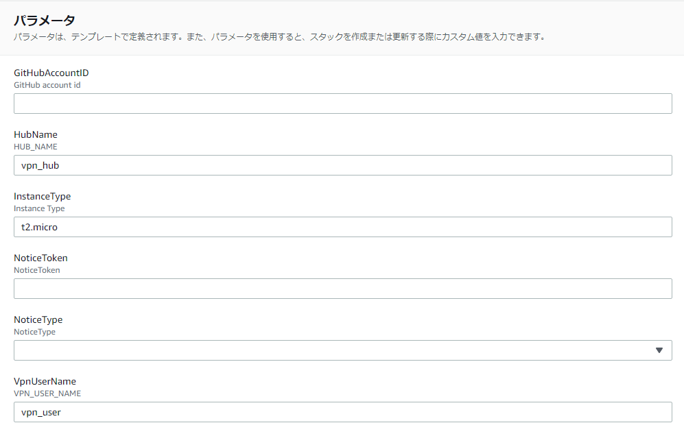

## 認証情報の取得

VPNサーバに接続するためには、

- 事前共有キー
- ユーザ名
- ユーザPW
- EC2のIPアドレス

が必要になります。

slackやLINEによる通知を設定した場合は、これらの情報が通知されます。
しかし、設定しなかった場合は、手動で取得する必要があります。

### 事前共有キー・ユーザPW

CloudFormationの出力に取得用のコマンドが表示される。
- GetVpnKeyByCLI: 事前共有キー
- GetVpnUserPWByCLI: ユーザPW

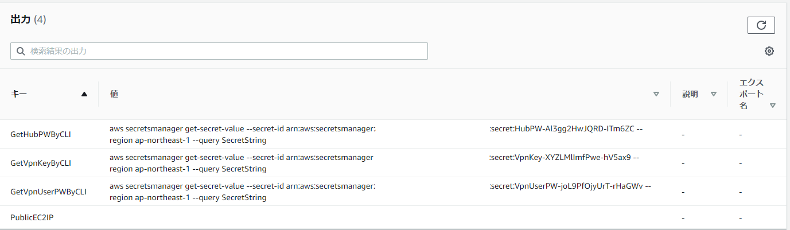

このコマンドを実行するとパスワードを取得できる。

**コマンドが使えない場合**

CloudFormationのリソースタブを開き、

- VpnKeyBy
- VpnUserPWBy

の論理IDを開く。

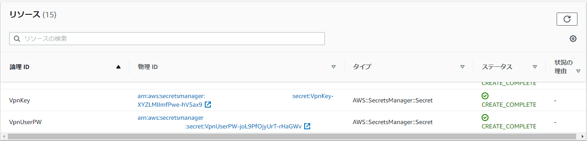

そして、シークレットの値を開くとパスワードを取得できる。

### EC2のIPアドレス

CloudFormationの出力にEC2のIPアドレスが表示される。

## VPN接続

**注意**
スタックのステータスが`CREATE_COMPLETE`の場合でも、裏でEC2のセットアップが行われておりVPN接続できない可能性があります。
slackなどの通知がセットアップが完了した合図です。

### Windowsの場合

1. WindowsのVPN設定を開く

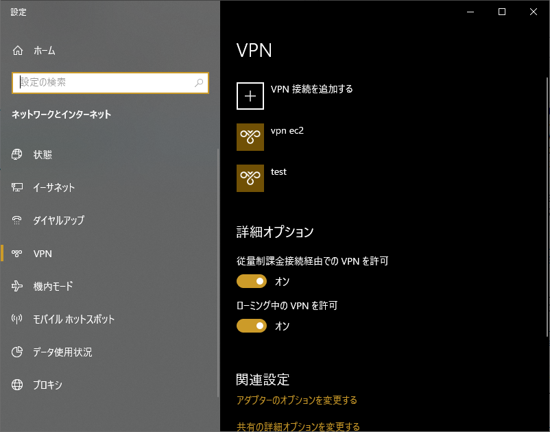

2. VPN接続を追加するをクリック

3. 以下の図のように値を入力する

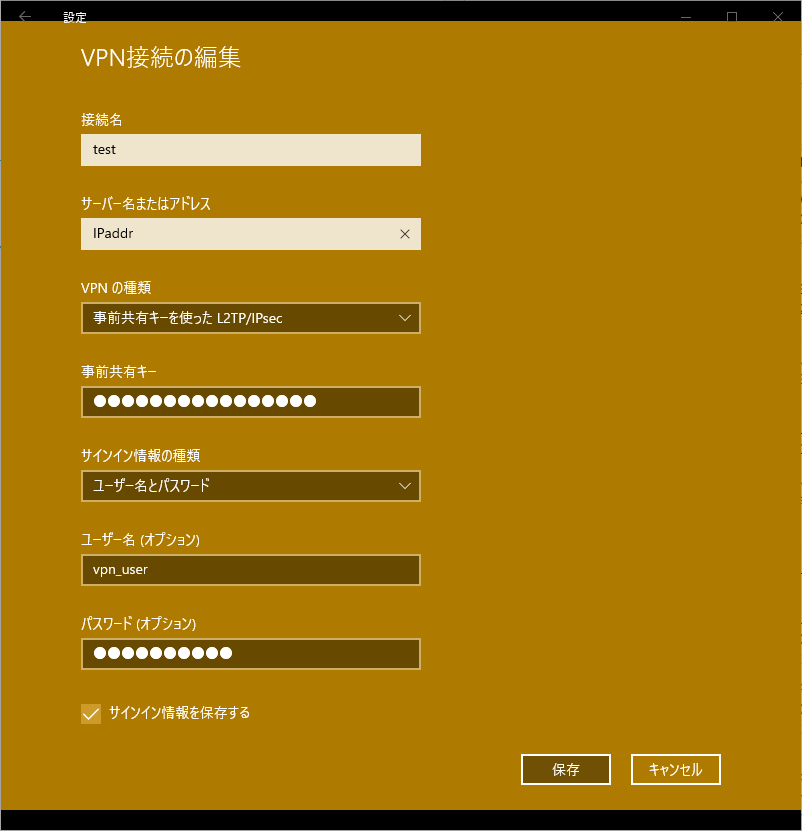

4. 接続を押すことで接続できる

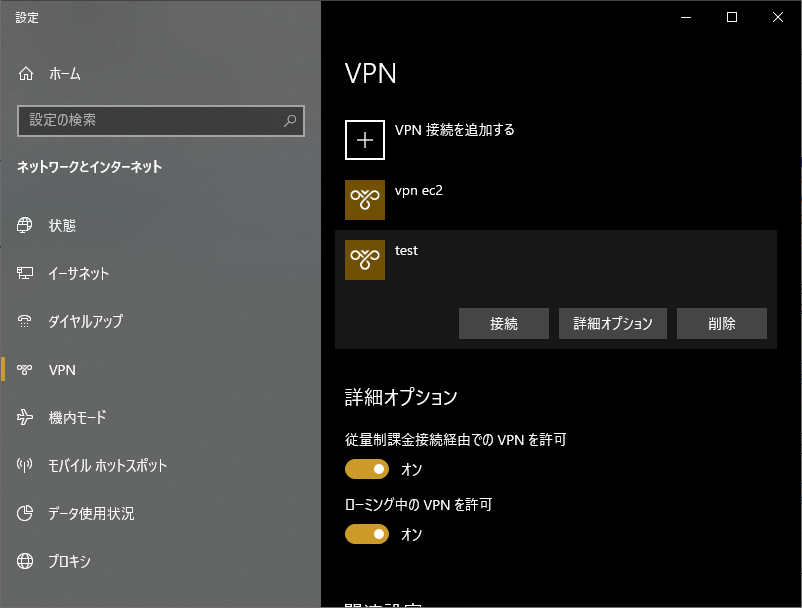

### MacOSの場合

1. ネットワーク設定を開き、左下のプラスを押す

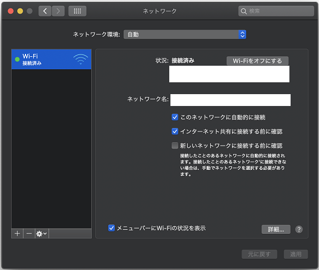

2. VPNを選択する

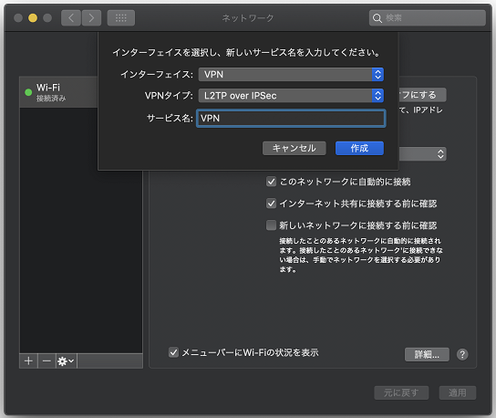

3. サーバアドレスにEC2のIPアドレス、アカウント名に指定したアカウント名を入力

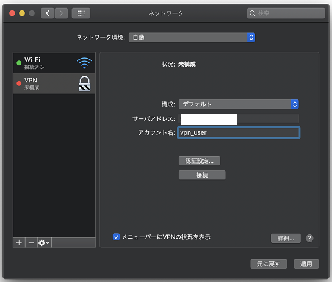

4. 認証設定を開き、ユーザのパスワード、共有シークレットを入力

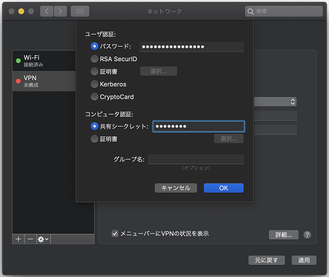

5. 接続を押すと接続できる

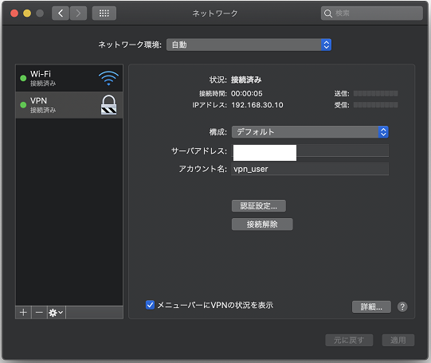

### Androidの場合

1. VPNの設定を開く

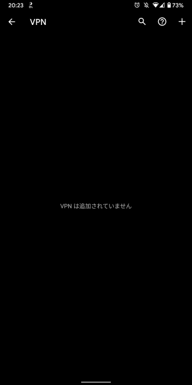

2. このように設定する

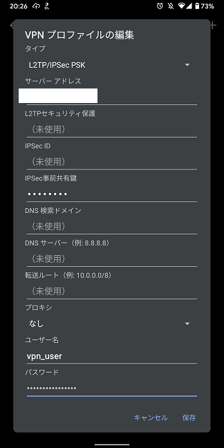

3. 接続する

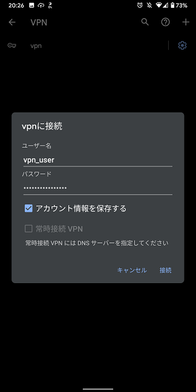

4. 接続できる

